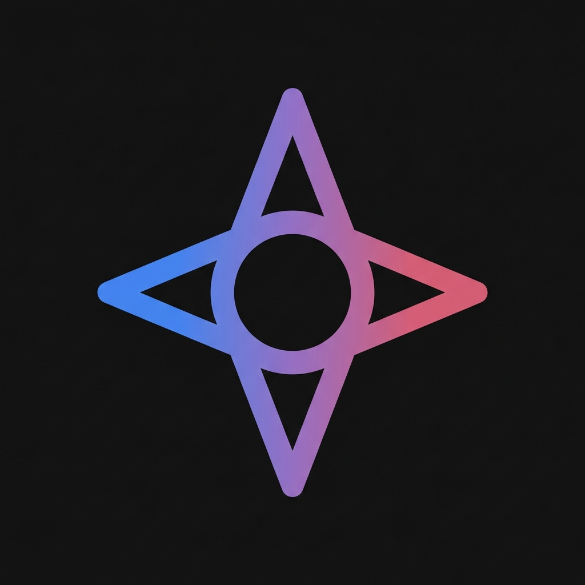

<div align="center">
  
  <br />
  <h1>Gemini Desktop One</h1>
  <p>
    <b>A premium, native-feeling desktop environment for Google Gemini.</b>
  </p>

  <a href="https://github.com/Pomurnik/GeminiDesktopOne/releases">
    
  </a>
  
  <a href="https://github.com/Pomurnik/GeminiDesktopOne/blob/main/LICENSE">
    
  </a>
  <a href="https://github.com/Pomurnik/GeminiDesktopOne/releases">
    
  </a>
  <br />
  
</div>

---

## 📖 Overview

**Gemini Desktop One** lifts the Google Gemini experience out of the browser tab and into a dedicated, high-performance desktop wrapper. Designed with a philosophy of "Native & Premium," it integrates deeply with Windows to provide a workflow-centric AI assistant.

It solves the common friction of browser-based AI: **tab clutter** and **slow access**. With global shortcuts and system tray integration, Gemini is always one keystroke away.

## ✨ Key Features

- **🎨 Premium Dark UI**: Meticulously styled window chrome (`#131314`) and settings interface that matches Gemini's native aesthetic.
- **🔐 Secure Login Bypass**: Intelligent header and session handling to navigate Google's "Unsafe Browser" restrictions without compromising security.
- **⚡ Global Hotkey**: Summon Gemini instantly from anywhere with `Ctrl+Shift+G` (or record your own shortcut).
- **📥 System Tray**: Runs silently in the background; click the tray icon or use the hotkey to toggle.
- **🚀 Auto-Start**: Optional system startup integration so your AI is ready when you are.
- **⚙️ Configurable Workflow**: Choose whether closing the window quits the app or minimizes it to the tray.

## 📥 Installation

1.  Navigate to the **[Releases](../../releases)** page.
2.  Download the latest installer: `GeminiDesktopOne Setup X.X.X.exe`.
3.  Run the installer.
4.  Log in securely with your Google Account.

## 🛠️ Development

We welcome contributions! The project follows a modular "Senior-Level" Electron architecture separating the Main process, Renderer process, and Services.

### Prerequisites

- **Node.js**: v18 or newer
- **npm**: v9 or newer

### Quick Start

1.  **Clone the repository**
    ```bash
    git clone https://github.com/yourusername/gemini-desktop-one.git
    cd gemini-desktop-one
    ```

2.  **Install dependencies**
    ```bash
    npm ci
    ```

3.  **Run locally**
    ```bash
    npm start
    ```

### Building for Production

To create a distributable Windows installer (`.exe`):

```bash
npm run dist
```
Artifacts will be generated in the `dist/` directory.

### Project Structure

```bash
src/
├── main/             # Backend (Node.js)
│   ├── config/       # Store & Defaults
│   ├── services/     # Tray, Shortcuts, AutoLaunch
│   ├── windows/      # Electron Window Definitions
│   └── index.js      # Entry Point
├── renderer/         # Frontend (Web)
│   ├── app/          # Main Wrapper View
│   └── settings/     # Settings Modal UI
└── preload/          # Context Bridge Scripts
```

## 🤝 Contributing

Contributions are what make the open source community such an amazing place to learn, inspire, and create. Any contributions you make are **greatly appreciated**.

1.  Fork the Project
2.  Create your Feature Branch (`git checkout -b feature/AmazingFeature`)
3.  Commit your Changes (`git commit -m 'Add some AmazingFeature'`)
4.  Push to the Branch (`git push origin feature/AmazingFeature`)
5.  Open a Pull Request

## 📄 License

Distributed under the MIT License. See `LICENSE` for more information.

## ⚠️ Disclaimer

This is an unofficial, open-source project. **Gemini** is a trademark of **Google LLC**. This application is not affiliated with, endorsed by, or maintained by Google.
